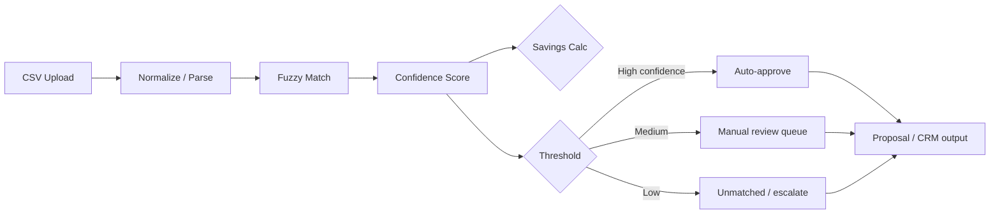

# Source Club Savings Analysis — Executive Summary

**Prepared for:** Hiring / leadership review  
**Project:** `sourceclub-savings-analysis-demo`  
**Status:** Working proof-of-concept (fictional dental procurement data)

---

## One-Minute Summary

Source Club’s prospect savings analysis is slowed down by **inconsistent product descriptions** across suppliers—not by math. This prototype shows how that bottleneck can be automated: upload purchase history, fuzzy-match against the Source Club catalog, score confidence, calculate savings, and route uncertain matches to humans. In the demo run, **four line items** produced **$256.70** in estimated annualized savings on a single small purchase sample, with **one match auto-approved** and **three sent for review**—the right balance for a pricing workflow where accuracy matters more than blind automation.

---

## The Business Problem

| Pain point | Impact |
|------------|--------|
| Supplier SKU and product naming vary widely | Sales and ops spend hours reconciling line items manually |
| Savings proposals are delayed | Slower close rates and weaker competitive positioning |
| Pricing errors are costly | Wrong matches erode trust and margin |
| Scale is limited by headcount | Each new prospect repeats the same manual work |

**Core insight:** The operational bottleneck is **product matching**, not spreadsheet formulas. Fix matching at scale and savings analysis becomes a repeatable system—not a one-off project.

---

## What We Built (This Demo)

A lightweight Python pipeline that demonstrates:

1. **CSV ingestion** — prospect purchase history + Source Club catalog  
2. **Fuzzy product matching** — RapidFuzz `token_sort_ratio` on product descriptions  
3. **Confidence scoring** — integer scores per match (0–100 scale)  
4. **Savings calculation** — `(current_price − sourceclub_price) × quantity` per line  
5. **Human-in-the-loop routing** — `AUTO_APPROVED`, `MANUAL_REVIEW`, or `UNMATCHED`

**Repository:** `C:\Users\rkedd\Projects\sourceclub-savings-analysis-demo` (publish via [SETUP_GITHUB.md](SETUP_GITHUB.md))  
**Run locally:** `pip install -r requirements.txt` → `python main.py`

---

## Demo Results (Fictional Data)

| Prospect product | Matched catalog item | Confidence | Workflow | Est. savings |
|------------------|----------------------|------------|----------|--------------|
| Nitrile Gloves Med Blue 100ct | Blue Nitrile Gloves Medium 100 Count | 83 | **AUTO_APPROVED** | $102.00 |
| 3M Prophy Angles Soft | 3M Disposable Soft Prophy Angles | 79 | MANUAL_REVIEW | $75.00 |
| Level 3 Earloop Masks 50ct | Level III Procedure Masks Earloop 50 Count | 68 | MANUAL_REVIEW | $65.70 |
| Cotton Rolls Large 200ct | Large Cotton Rolls 200 Count | 85 | MANUAL_REVIEW | $14.00 |

| Metric | Value |
|--------|-------|
| **Total estimated savings (sample)** | **$256.70** |
| Line items processed | 4 |
| Auto-approved | 1 |
| Manual review | 3 |
| Unmatched | 0 |

*All figures use fictional SKUs and prices for demonstration only.*

---

## Architecture (Layered Matching Strategy)

This prototype intentionally uses a **pragmatic, layered** approach—the same pattern recommended before investing in heavier AI infrastructure:

| Layer | Role in this demo | Production evolution |
|-------|-------------------|----------------------|
| **1. Deterministic** | SKU alignment (future) | Exact matches, approved mapping table |
| **2. Fuzzy** | **Implemented here** | RapidFuzz / rules by category |
| **3. Semantic AI** | Not in MVP | Embeddings, vector search, LLM-assisted match |
| **4. Human review** | **Implemented here** | Review UI, auditor feedback loop |

**Design principle:** Start with fast, explainable matching; add AI where fuzzy logic plateaus; never remove humans from low-confidence pricing decisions.

---

## Human-in-the-Loop (Why It Matters)

- **AUTO_APPROVED** — only the clearest matches (demo: nitrile gloves at confidence 83 in calibrated band).  
- **MANUAL_REVIEW** — borderline matches still save analyst time: the system proposes the catalog item and savings; humans confirm or correct.  
- **UNMATCHED** — protects margin and credibility when confidence is too low.

Over time, **approved manual matches become training data**, improving rules, thresholds, and future semantic models. Automation compounds; it does not replace judgment on day one.

---

## Business Value

| Lever | Outcome |
|-------|---------|
| **Speed** | Minutes instead of hours to draft a prospect savings summary |
| **Consistency** | Same matching logic and thresholds across reps and regions |
| **Scalability** | Process more RFPs and prospects without linear headcount growth |
| **Quality** | Confidence gates reduce pricing mistakes vs. fully manual spreadsheets |
| **Revenue** | Faster, data-backed savings stories support conversion and retention |

**ROI framing (illustrative):** If this workflow saves **5 hours per prospect** and the team evaluates **20 prospects/month**, that is **~100 hours/month** redirected to selling and strategic accounts—not SKU reconciliation.

---

## Roadmap (Beyond This MVP)

| Phase | Capability |
|-------|------------|
| **Now** | CSV upload, fuzzy match, savings CSV, review thresholds |
| **Next** | OpenAI embeddings + vector search for semantic match |
| **Next** | OCR for invoice / quote ingestion |
| **Next** | HubSpot (or CRM) integration for automated proposal drafts |
| **Later** | Review dashboard + feedback loop for continuous learning |

---

## Positioning: Why This MVP First

This is **not** a pitch for a perfect AI system on day one. It demonstrates:

- **Operational leverage** — automate the repetitive matching layer  
- **Systems thinking** — layered architecture that scales with data and budget  
- **Practical automation** — shippable in days, tunable thresholds, auditable output  
- **AI-assisted workflow** — clear path from fuzzy logic → embeddings without big-bang risk  
- **Implementation realism** — the kind of MVP worth building before a large platform investment  

---

## Suggested Talking Points (5-Minute Presentation)

1. **Problem** — “Supplier descriptions don’t line up with our catalog; that’s why savings analysis doesn’t scale.”  
2. **Architecture** — “Deterministic matching first, fuzzy second, semantic AI when the data justifies it.”  
3. **Human review** — “We auto-approve only high-confidence matches; pricing accuracy beats full automation.”  
4. **Scalability** — “Every approved match makes the next prospect faster and smarter.”  
5. **Ask** — “This demo proves the workflow; the next step is piloting on real (anonymized) prospect data with your ops team.”

---

## Technical Appendix

| Item | Detail |
|------|--------|
| Stack | Python 3, Pandas, RapidFuzz |
| Entry point | `main.py` |
| Inputs | `data/purchase_history.csv`, `data/sourceclub_catalog.csv` |
| Output | `output/savings_analysis_output.csv` |
| Thresholds | `AUTO_APPROVE_MIN/MAX`, `MANUAL_REVIEW` in `main.py` |

---

*Demo repository: `sourceclub-savings-analysis-demo` — fictional data only; not production pricing.*
